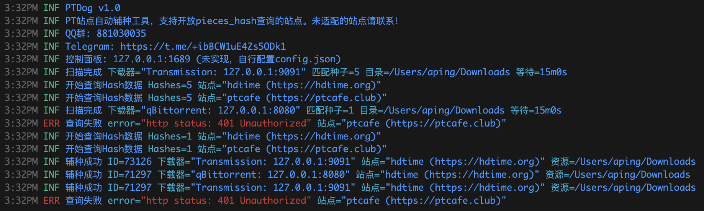
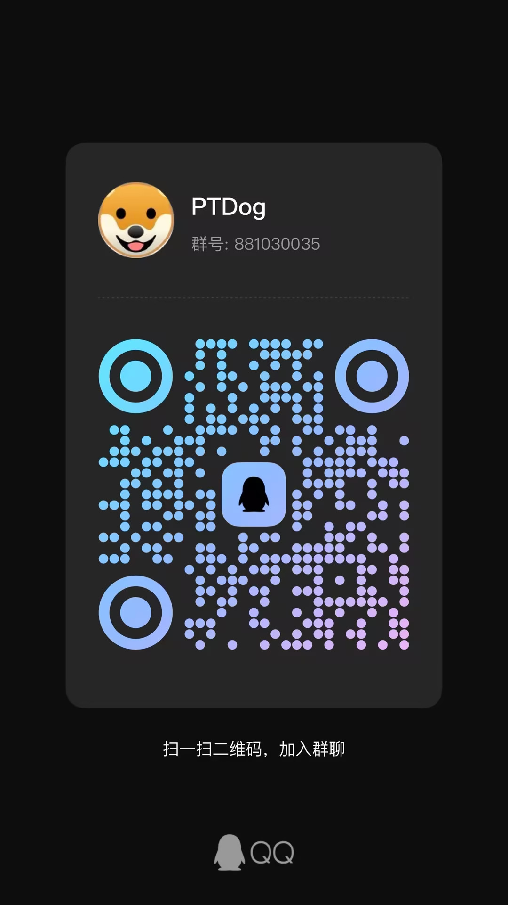

## PTDog

开源PT站点自动辅种工具，支持开放pieces_hash查询的站点。未适配的站点请联系！



## 管理面板
本计划自带web管理面板的，但实在不想写前端，可能在不久也会继续完善吧（有没有大佬能fork来完善一下管理面板呢）。暂时先自行配置[config.json](config.json)吧。

## 运行
下载相关平台的二进制程序或自行编译，下载或复制config.json，运行程序。
[去Releases下载](https://github.com/iaping/ptdog/releases)

## 配置说明
```json
{
    "http": {
        "addr": "127.0.0.1:1689" // 管理面板地址，不用管，反正也没完全实现
    },
    "system": {
        "sleep": 15 // 扫描周期，单位：分钟
    },
    "clients": [
        {
            "enable": true, // 下载器是否启用
            "https": false, // 默认即可
            "type": 0, // 下载器类型，0=transmission 1=qBittorrent
            "host": "127.0.0.1", // 下载器IP，默认即可
            "username": "admin", // 下载器用户名
            "password": "123456", // 下载器密码
            "port": 9091, // 下载器端口
            "timeout": 60, // 下载器超时，单位：秒
            "dir": "/Users/aping/Downloads", // 下载器对应该的种子目录
            "skip_checking": false // 是否跳过校验
        },
        {
            "enable": true, // 同上，如果你有多个下载器，复制修改即可
            "https": false,
            "type": 1,
            "host": "127.0.0.1",
            "username": "admin",
            "password": "123456",
            "port": 8080,
            "timeout": 60,
            "dir": "/Users/aping/Downloads",
            "skip_checking": false
        }
    ],
    "websites": [
        {
            "enable": true, // 是否启用辅种站点
            "name": "ptcafe", // 站点名称
            "domain": "https://ptcafe.club", // 站点网址，需要带http或https完整，可参考下面配置
            "api": "https://ptcafe.club/api/pieces-hash", // pieces hash查询API，可参考下面配置
            "passkey": "your passkey", // 你账号的passkey
            "download": "", // 自定义种子链接地址，留空即可，除非你系统不是Nexus那套
            "limit": 0 // 批次hash查询数量，默认0即可
        },
        {
            "enable": true, // 同上，你要辅种多少个站点，复制修改即可
            "name": "hdtime",
            "domain": "https://hdtime.org",
            "api": "https://hdtime.org/api/pieces-hash",
            "passkey": "your passkey",
            "download": "",
            "limit": 0
        }
    ]
}
```

## 支持的下载器
 1. transmission
 2. qBittorrent

## 支持自动辅种的站点（未收录站点请联系）
| name | domain | api |
| ---- | ---- | ---- |
| 红叶 | https://leaves.red | https://leaves.red/api/pieces-hash |
|猪猪 | https://piggo.me | https://api.piggo.me/api/pieces-hash |  
| ultrahd | https://ultrahd.net | https://ultrahd.net/api/pieces-hash |  
| zmpt(织梦) | https://zmpt.cc | https://zmpt.cc/api/pieces-hash |  
| hdtime | https://hdtime.org | https://hdtime.org/api/pieces-hash |  
| 月月 | https://pt.keepfrds.com | https://pt.keepfrds.com/api/torrents/pieces-hash |  
| ptlsp | https://www.ptlsp.com | https://www.ptlsp.com/api/pieces-hash |  
| 憨憨 | https://hhanclub.top | https://hhanclub.top/npapi/pieces-hash |  
| 大青虫 | https://cyanbug.net | https://cyanbug.net/api/pieces-hash |  
| icc | https://www.icc2022.com | https://www.icc2022.com/api/pieces-hash |  
| 1ptba | https://1ptba.com | https://1ptba.com/api/pieces-hash |  
| ptcafe | https://ptcafe.club | https://ptcafe.club/api/pieces-hash |  
| kufei | https://kufei.org | https://kufei.org/api/pieces-hash |  
| rousi | https://rousi.zip | https://rousi.zip/api/pieces-hash |  
| 东樱 | https://wintersakura.net | https://wintersakura.net/api/pieces-hash |  
| oshen | https://www.oshen.win | https://www.oshen.win/api/pieces-hash |  
| 明教 | https://hdpt.xyz | https://hdpt.xyz/api/pieces-hash |  
| 2xfree | https://pt.2xfree.org | https://pt.2xfree.org/api/pieces-hash |  
| 阿童木 | https://hdatmos.club | https://hdatmos.club/api/pieces-hash |  
| 3wmg明教 | https://www.3wmg.com | https://www.3wmg.com/api/pieces-hash |  

## 需求提交/错误反馈
 